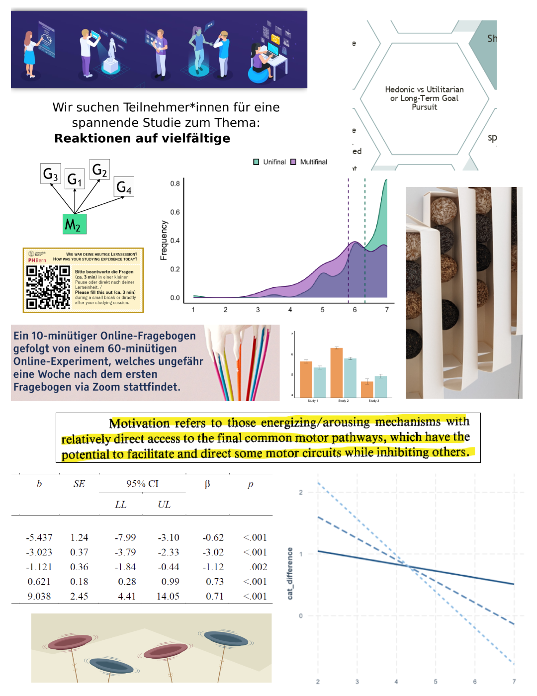

# Hi there!
I am Aiste. I am a Clinical Research Data and Program Coordinator at Cooper Univerity Health Care. I completed my psychology PhD at the University of Zurich in the Motivation, Volition, and Emotion lab, in May 2025. My academic research primarily focuses on choice and evaluation in the context of long-term and hedonic goals and I have a background in survey analysis and clinical outcomes measurement. Beyond goal-pursuit, I am broadly interested in health and well-being, decision making, and research methods.

<a href="https://scholar.google.com/citations?user=BqeMwcAAAAAJ&hl=en" target="_blank">My Google Scholar</a>

## Education
PhD Psychology (2025), University of Zurich 
&nbsp;&nbsp;&nbsp;&nbsp;Dissertation: <i>Combining Long-Term and Hedonic Goals: Experience, Evaluation, and Choice</i> 
 
MSc Applied Social Research (2015), Trinity College Dublin 
&nbsp;&nbsp;&nbsp;&nbsp;Thesis: <i>A qualitative exploration of methadone maintained patients’ experiences of treatment and recovery</i> 
 
BA Psychology (2013), Maynooth University  

## Publications

Bernecker, K., Becker, D., & <strong>Guobyte, A.</strong> (2025). High Self-Control Individuals Prefer Meaning over Pleasure. <em>Social Psychology and Personality Science</em>. <a href="https://doi.org/10.1177/19485506251323948" target="_blank">https://doi.org/10.1177/19485506251323948</a>

Becker, D., Bernecker, K., <strong>Guobyte, A.,</strong> & Ganama, D. (2024). 'Pleasureful self-control'? A new perspective on old problems. <em>Current Opinion in Psychology,</em> 101888. <a href="https://doi.org/10.1016/j.copsyc.2024.101888" target="_blank">https://doi.org/10.1016/j.copsyc.2024.101888</a>

Bernecker, K., Becker, D., & <strong>Guobyte, A.</strong> (2023). If the party is good, you can stay longer—effects of trait hedonic capacity on hedonic quantity and performance. <em>Motivation and Emotion</em>, 47(5), 711-725. <a href="https://doi.org/10.1007/s11031-023-10021-6" target="_blank">https://doi.org/10.1007/s11031-023-10021-6</a>

Dubinsky, M. C., Newton, L., Delbecque, L., Hunter, T., <strong>Guobyte, A</strong>., Naegeli, A. N., ... & Lewis, J. D. (2022). Exploring disease remission and bowel urgency severity among adults with moderate to severe ulcerative colitis: a qualitative study. <em>Patient Related Outcome Measures</em>, 287-300. <a href="https://doi.org/10.2147/PROM.S378759" target="_blank">https://doi.org/10.2147/PROM.S378759</a>

Hudgens S., Gugiu, C., <strong>Guobyte, A</strong>., Soliman, A. M., Fitzgerald, K. A., Barcomb, L. M., Eldred, A. K., & Okun, M. M. (2022). Validation of the Physician's Global Assessment of Fingernail Psoriasis by Rheumatologists Treating Psoriatic Arthritis. <em>Value in Health</em>, 25(9), 1582-1589. <a href="https://doi.org/10.1016/j.jval.2022.04.1727" target="_blank">https://doi.org/10.1016/j.jval.2022.04.1727</a>

Randall, J. A., <strong>Guobyte, A</strong>., Delbecque, L., Newton, L., Symonds, T., & Hunter, T. (2020). Qualitative research to explore the symptoms and impacts experienced by children with ulcerative colitis. <em>Journal of Patient-Reported Outcomes</em>, 4(1), 1-13. <a href="https://doi.org/10.1186/s41687-020-00238-1" target="_blank">https://doi.org/10.1186/s41687-020-00238-1</a>

## Collage of Work

I plan to upload some of my work in the future (following manuscript review periods, completion of projects, etc.)

